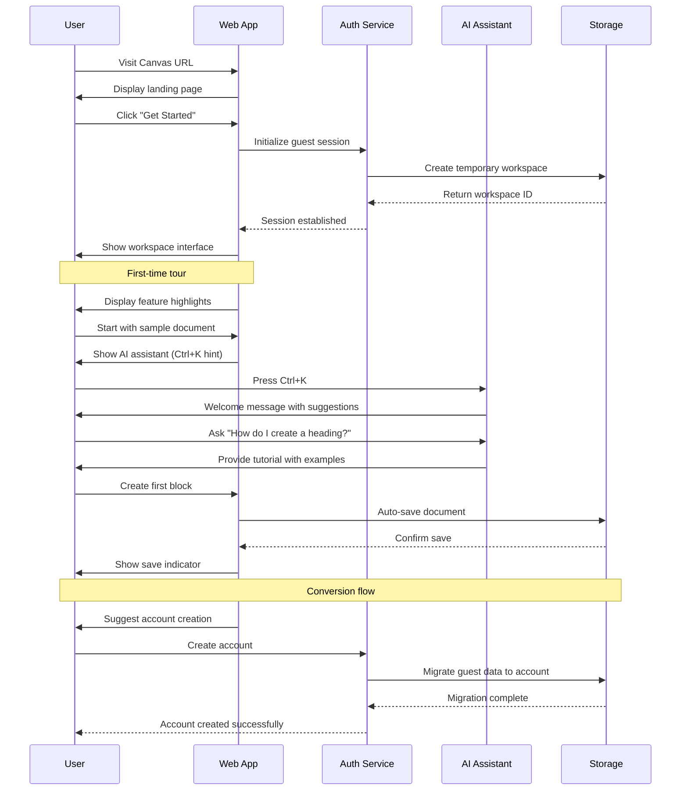
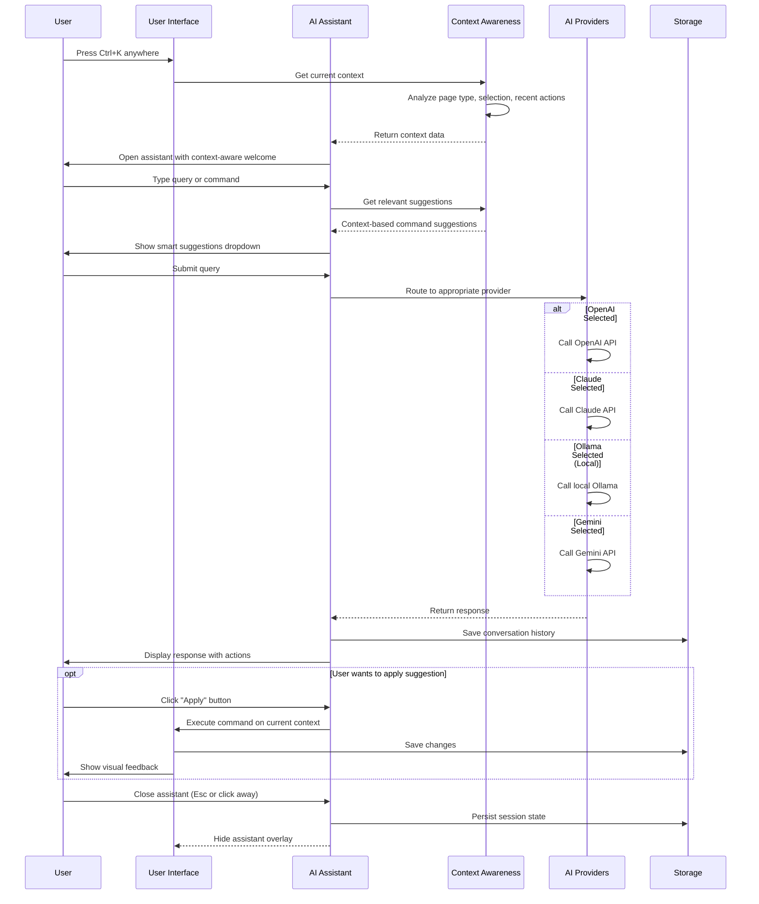
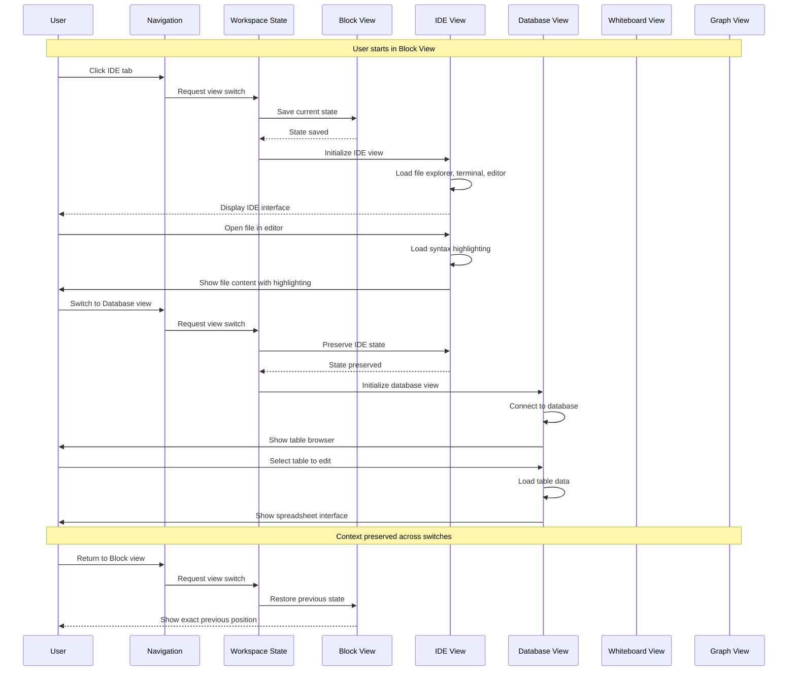
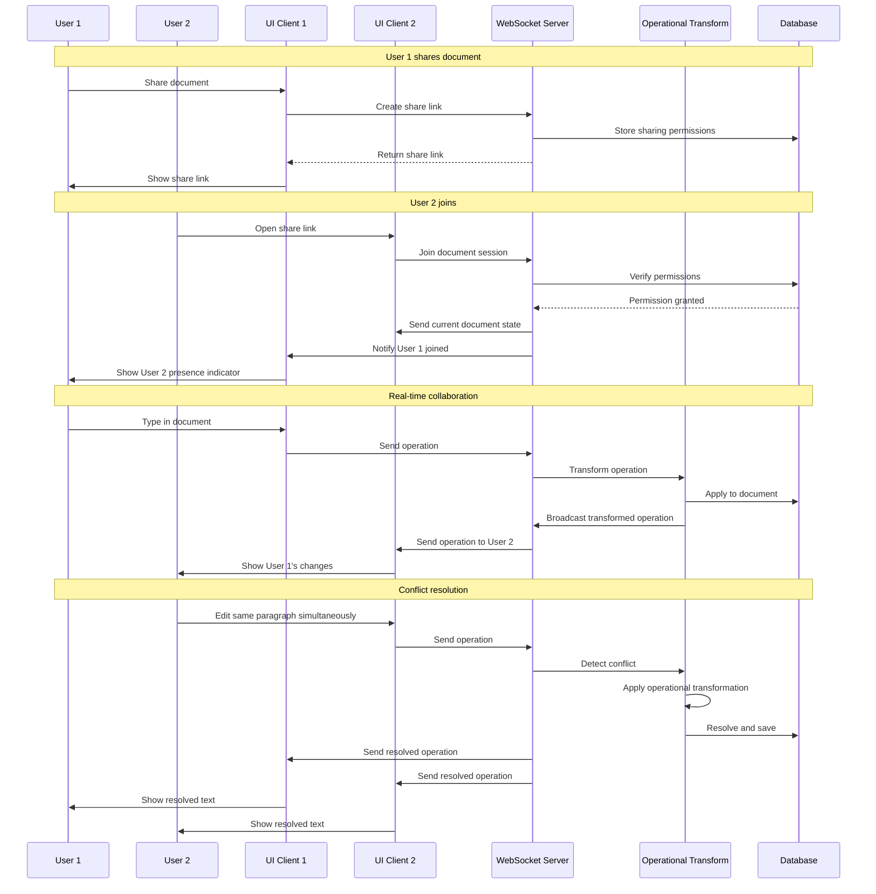
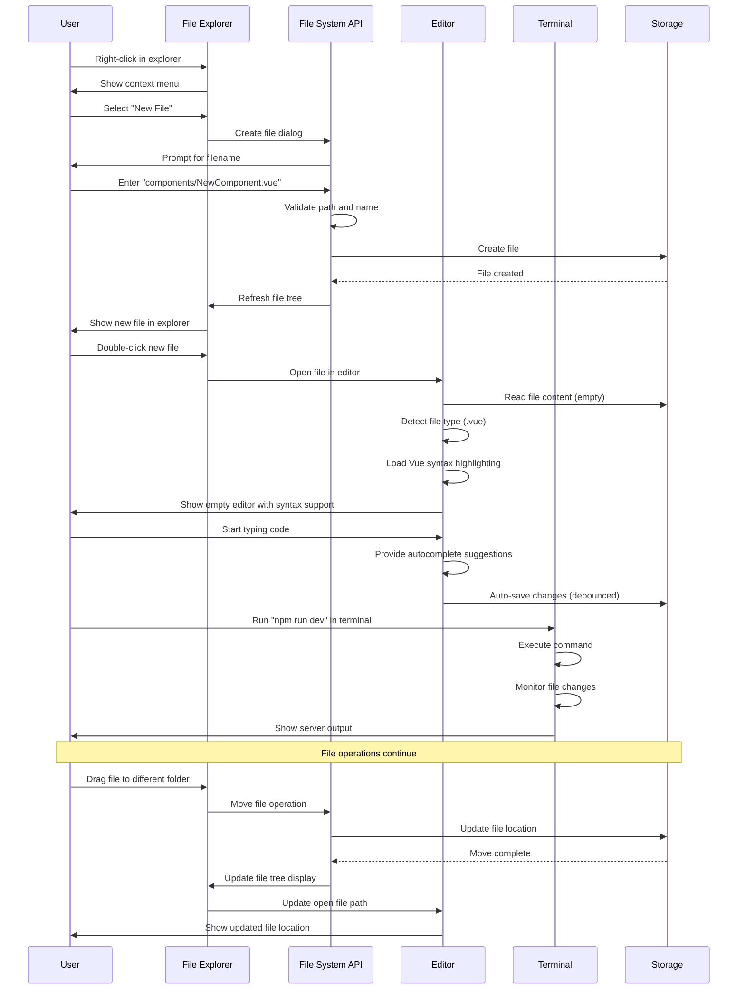
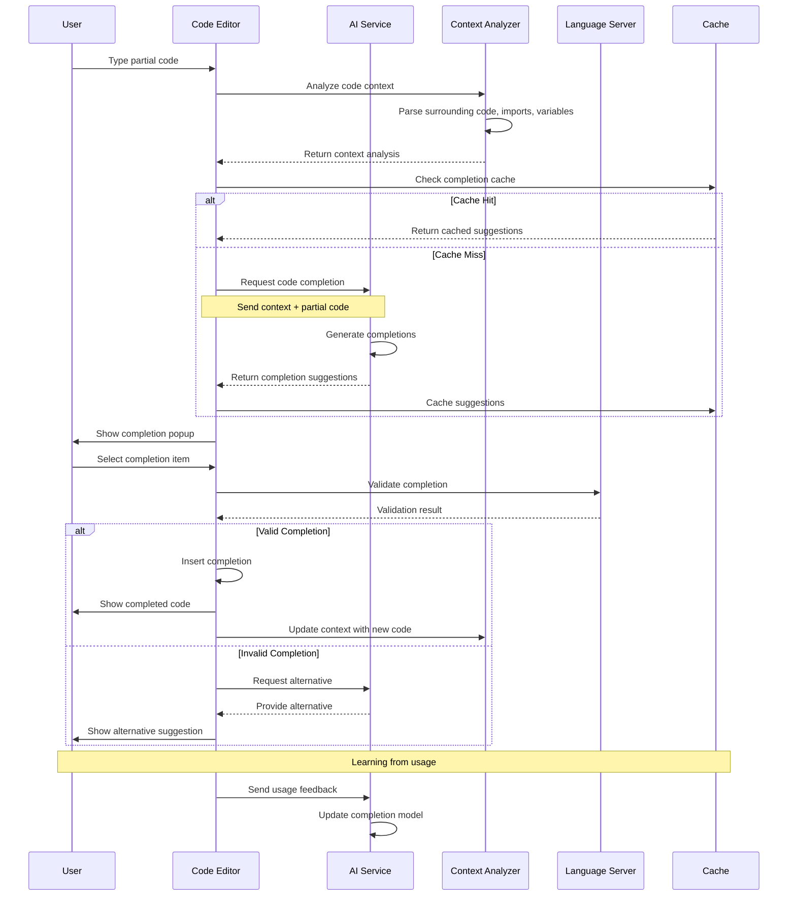
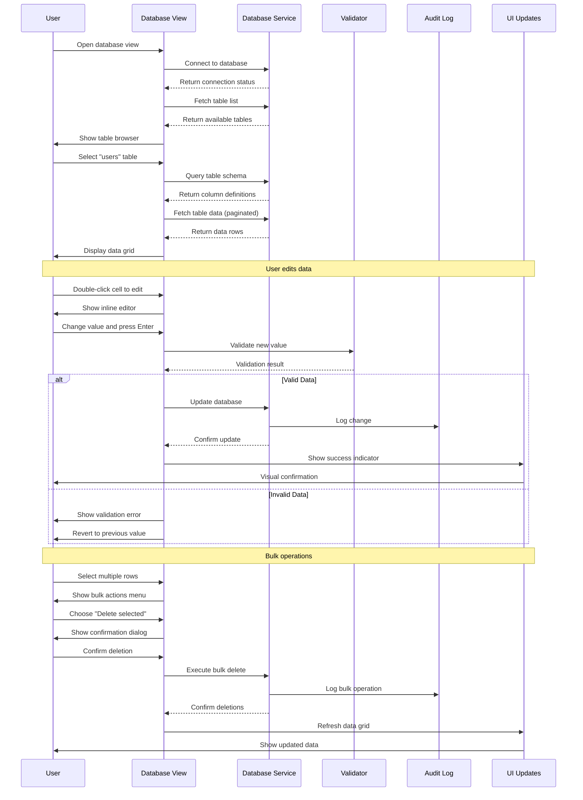
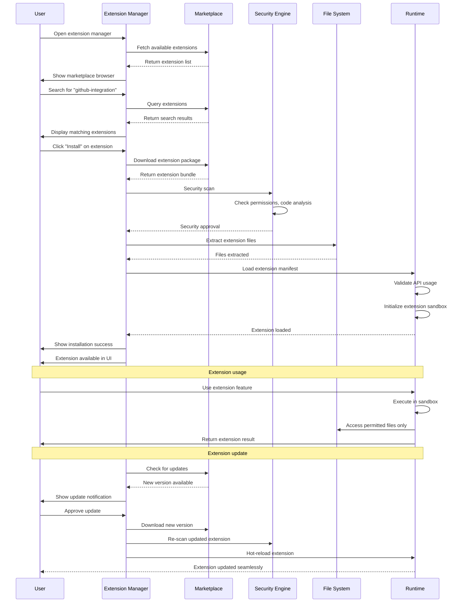
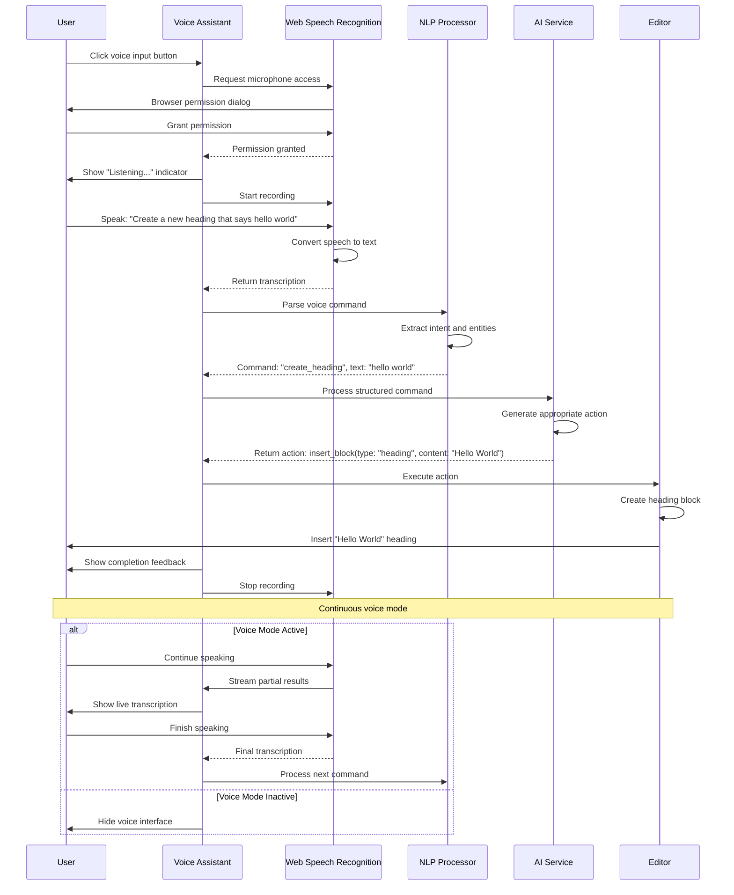
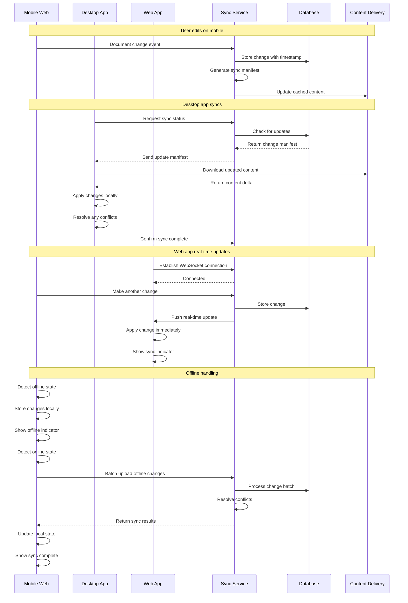

# Canvas Digital Workspace - Swimlane Diagrams

## Overview
This document contains swimlane diagrams representing key user flows and system processes in Canvas. Each diagram shows the interaction between different actors (users, systems, services) across time.

---

## 1. User Onboarding & First Experience

---

## 2. AI Assistant Interaction Flow

---

## 3. Multi-View Workspace Navigation

---

## 4. Collaborative Document Editing

---

## 5. File System Operations in IDE

---

## 6. AI-Powered Code Completion

---

## 7. Database Operations Workflow

---

## 8. Extension Installation & Management

---

## 9. Voice Input Processing

---

## 10. Cross-Platform Synchronization

---

## Process Flow Summary

### Key Insights from Swimlanes

1. **User Experience Flows**
   - Consistent AI assistant access (Ctrl+K) across all contexts
   - Context-aware suggestions improve user productivity
   - Seamless view switching maintains user flow state

2. **Technical Integration Points**
   - WebSocket connections enable real-time collaboration
   - Operational transformation ensures conflict-free editing
   - Extension sandbox provides security while enabling extensibility

3. **Performance Considerations**
   - Caching strategies reduce AI response times
   - Debounced auto-save prevents performance issues
   - Progressive loading improves initial user experience

4. **Security & Reliability**
   - Permission validation at multiple layers
   - Audit logging for all data changes
   - Graceful fallback handling for service failures

5. **Cross-Platform Consistency**
   - Unified sync mechanism across all platforms
   - Consistent UI patterns and interactions
   - Offline-first architecture with conflict resolution

---

**Document Version:** 1.0  
**Last Updated:** August 26, 2025  
**Diagrams Created:** 10  
**Next Review:** September 10, 2025  

*These swimlane diagrams should be updated as new features are implemented and user flows evolve. Consider creating sequence diagrams for specific technical implementations during development.*